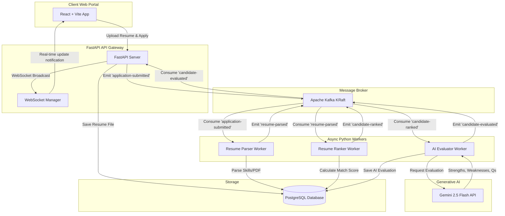
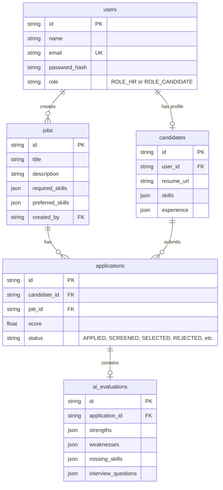

# 🤖 AI-Powered Hiring & Resume Screening Platform

A modern, full-stack, event-driven recruiting platform designed to streamline candidate applications and automate resume parsing, scoring, and deep AI evaluation.

The system uses **FastAPI** on the backend, **React (Vite)** on the frontend, and a **Kafka** message broker to coordinate async workflows across multiple specialized workers. Deep candidate evaluations are powered by **Gemini 2.5 Flash** (via the Google GenAI SDK).

---

## 🌟 Key Features

### 👤 Candidate View
- **Authentication**: JWT-based sign-up and sign-in.
- **Profile Management**: Upload resumes (PDF or TXT) and view parsed technical skills and work history.
- **Job Board**: Browse available openings and view detailed requirements/preferences.
- **One-Click Application**: Apply for jobs by submitting resumes.
- **Application Tracking**: Monitor evaluation progress in real-time.

### 💼 Recruiter (HR) View
- **Job Management**: Create and manage job openings with specified Required and Preferred Skills.
- **Candidate Pool**: View applicants, their match scores, and status stages.
- **Automated Resume Screening**: Matches skills automatically, giving instant feedback and screening status.
- **AI-Powered Evaluation**: Deep analysis of candidate strengths, weaknesses, and missing skills.
- **Custom Interview Questions**: Generates tailored technical questions mapping candidate gaps to job requirements.
- **Interactive Analytics**: Dashboard highlighting total jobs, applications, average scores, and candidate distributions.
- **Live Notifications**: WebSocket integration for real-time updates as candidates are screened and evaluated.

---

## 🏗 System Architecture

The application is designed around an event-driven, microservices-style architecture using Apache Kafka to coordinate asynchronous work:



### Kafka Event Flow & Worker Tasks
1. **`application-submitted`**: Produced by FastAPI when a candidate applies.
   - **Parser Worker** consumes it, parses PDF/TXT resumes using `pypdf`, extracts technical skills, and creates a structured candidate profile.
   - Produces `resume-parsed`.
2. **`resume-parsed`**: Produced by the Parser Worker.
   - **Ranker Worker** consumes it, calculates a skill matching score (70% weight for Required Skills, 30% weight for Preferred Skills), and flags status as `SCREENED`.
   - Produces `candidate-ranked`.
3. **`candidate-ranked`**: Produced by the Ranker Worker.
   - **Evaluator Worker** consumes it, calls the Gemini 2.5 Flash API to analyze the candidate's resume relative to the job requirements, and updates database records with strengths, weaknesses, and personalized interview questions.
   - Produces `candidate-evaluated`.
4. **`candidate-evaluated`**: Produced by the Evaluator Worker.
   - **FastAPI WS Listener** consumes it and broadcasts a real-time event via WebSockets (`/ws`) to update recruiting dashboards instantly.

> [!NOTE]
> **Zero-Dependency Fallback (Mock Mode)**: If Kafka is not running or unreachable, the backend automatically transitions to **Mock Mode**. In Mock Mode, background tasks run sequentially in-memory via FastAPI's `BackgroundTasks`, enabling testing of the entire pipeline out-of-the-box without Docker or Kafka!

---

## 🛠 Tech Stack

- **Frontend**: React (Vite), React Router, HTML5, Vanilla CSS (Glassmorphism & modern UI), Lucide React.
- **Backend API**: FastAPI, Uvicorn, SQLAlchemy.
- **Database**: PostgreSQL (Dockerized) / SQLite (for test fallbacks).
- **Event Broker**: Apache Kafka (KRaft mode, confluent-kafka python driver).
- **AI Integration**: Google GenAI SDK (Gemini 2.5 Flash).
- **Resume Processing**: PyPDF.
- **Containerization**: Docker & Docker Compose.

---

## 📂 Database Schema

The database consists of 5 main tables:



---

## ⚙️ Environment Variables

Before running, create a `.env` file in the root directory (or inject variables directly) with the following parameters:

```env
# Gemini API Key (Required for AI resume evaluation, defaults to mock heuristics if empty)
GEMINI_API_KEY=your-gemini-api-key

# JWT Secret for authenticating users
JWT_SECRET=supersecretjwtkeyforhiringplatform123!
```

---

## 🚀 Quick Start (Docker Compose)

The easiest way to run the entire pipeline (frontend, backend, database, Kafka, and 3 workers) is with Docker Compose.

### Step 1: Clone and set environment
Make sure you have Docker installed and running. Create a `.env` file or export `GEMINI_API_KEY`.

### Step 2: Launch the Services
Run the following command in the root directory:
```bash
docker-compose up --build
```
This will build and spin up the following containers:
- **`postgres`** (Port `5432`): Core database.
- **`kafka`** (Port `9092`): Message broker.
- **`backend`** (Port `8000`): FastAPI server.
- **`parser-worker`**: Resume parser background task.
- **`ranker-worker`**: Candidate scorer background task.
- **`evaluator-worker`**: Gemini-powered AI evaluator.
- **`frontend`** (Port `3000`): React client app.

### Step 3: Access the Apps
- **Frontend App**: [http://localhost:3000](http://localhost:3000)
- **API Swagger Docs**: [http://localhost:8000/docs](http://localhost:8000/docs)
- **API Redoc UI**: [http://localhost:8000/redoc](http://localhost:8000/redoc)

---

## 🧑‍💻 Manual Development & Testing (Local Setup)

If you prefer to run services individually without Docker (or in Fallback Mode):

### 1. Database & Kafka Setup
You can run only Postgres and Kafka via Docker Compose if desired:
```bash
docker-compose up postgres kafka
```
*Note: If Kafka is not running, the application will run in Fallback Mode.*

### 2. Backend API Setup
1. Navigate to the backend directory and create a virtual environment:
   ```bash
   cd backend
   python -m venv .venv
   source .venv/bin/activate  # On Windows: .venv\Scripts\activate
   ```
2. Install python dependencies:
   ```bash
   pip install -r requirements.txt
   ```
3. Run the FastAPI development server:
   ```bash
   export GEMINI_API_KEY="your_api_key_here"  # Optional
   uvicorn app.main:app --reload --port 8000
   ```

### 3. Running the Workers (If Kafka is running)
In separate terminals inside the backend directory (with virtual env active):
- **Parser Worker**:
  ```bash
  python -m workers.parser_worker
  ```
- **Ranker Worker**:
  ```bash
  python -m workers.ranker_worker
  ```
- **Evaluator Worker**:
  ```bash
  python -m workers.evaluator_worker
  ```

### 4. Frontend API Setup
1. Navigate to the frontend directory:
   ```bash
   cd frontend
   npm install
   ```
2. Start the Vite server:
   ```bash
   npm run dev
   ```
3. Access the page at [http://localhost:3000](http://localhost:3000).

---

## 🧪 Testing

Unit and integration tests are available for the backend application:

```bash
cd backend
pytest
```

---

## 📝 Demo Guide & Walkthrough
1. **Create an HR Recruiter**: Register an account with role `Recruiter (HR)`.
2. **Create a Job Post**: Post a job with specific required and preferred skills (e.g. required: `Python`, `FastAPI`; preferred: `Docker`, `React`).
3. **Create a Candidate**: Open a different window (or register a new account) with the role `Job Candidate`.
4. **Apply with a Resume**: Browse jobs, select the job you just created, upload a resume (e.g. `test_resume.txt` or a PDF containing skills like Python, FastAPI, and Docker), and click Apply.
5. **Real-time Evaluation Flow**: 
   - The application status will transition from `APPLIED` to `SCREENED` automatically.
   - Switch back to the Recruiter dashboard. You will see the candidate's score update in real-time (via WebSockets!).
   - Click **View AI Review** to inspect the Gemini-generated strengths, weaknesses, and custom interview questions!
